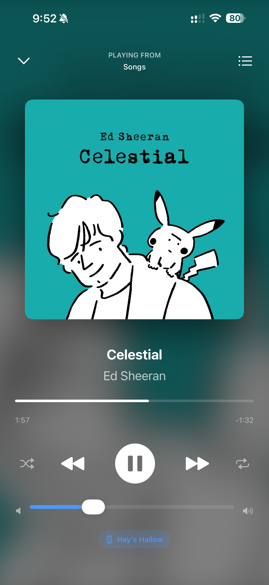
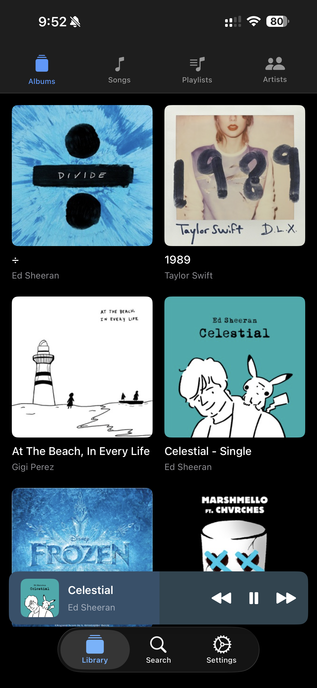
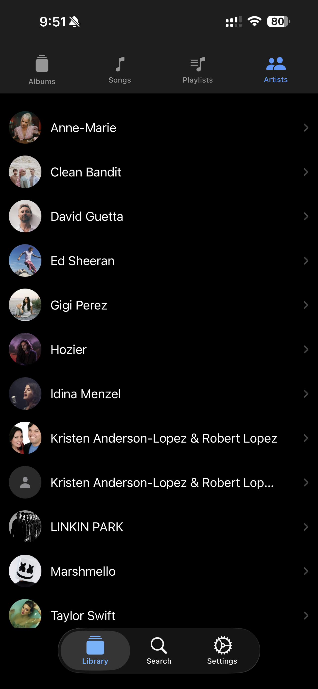
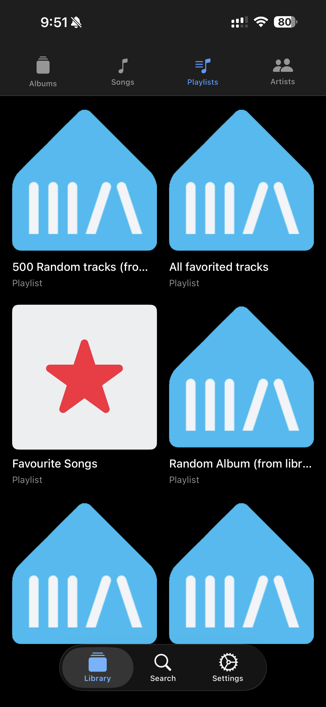

# Xonora for iOS (original app, v1.0.8)

> ## Archived
>
> This repository is the **final open-source release of the original Xonora app**: a standalone Swift/SwiftUI [Music Assistant](https://music-assistant.io/) client for iPhone, iPad, Apple Watch and CarPlay, with Siri support and Sendspin playback. It is published as-is for reference and reuse under the GPL. It is **retired and unsupported** — no further development, and issues or pull requests against this code will not be actioned.
>
> The new Xonora app (iOS, Android and CLI on a shared C++ core) is in TestFlight and is not open source; this repository is the final open-source release of the original app.
>
> - **Current app (iOS):** [Join the Xonora TestFlight](https://testflight.apple.com/join/5rUk1uqN)
> - **Community:** [Xonora Discord](https://discord.gg/x6cWh4AjNG)
> - **This app (v1.0.8):** [unsigned IPA on the v1.0.8 release](https://github.com/hayupadhyaya/xonora-ios/releases/tag/v1.0.8) for sideloading, or build from source below.

<p align="center">
  
</p>

## What this is

Xonora v1.0.8 is a native client for a self-hosted Music Assistant server. It talks to the server over its WebSocket API, browses the full library (albums, artists, tracks, playlists, podcasts, radio, audiobooks) and plays audio on the phone itself through the Sendspin protocol, or controls any other Music Assistant player.

- **Playback**: gapless, lossless-capable PCM/FLAC streaming through the bundled SendspinKit engine (AVAudioEngine); lock-screen and remote controls; Bluetooth and AirPlay; sleep timer; lyrics.
- **Library**: browse and search everything on the server, favourites, queue management, "continue listening" on Home, artwork caching for instant loads.
- **Players**: switch between every Music Assistant player, long-press mini-player switcher, volume sync, basic grouping.
- **CarPlay**: browse the library and control Now Playing from the car.
- **Siri**: play artists, albums, playlists and podcasts by voice (`XonoraIntents` extension).
- **Apple Watch**: companion app relayed through the iPhone (play/pause, skip, volume, player switching).
- **Login**: username/password login with the server's auth API, or a long-lived access token; automatic server discovery on the local network.
- **34 languages**: full localisation with an in-app language picker.

The user-facing guide is in [WIKI.md](WIKI.md); the code walkthrough is in [ARCHITECTURE.md](ARCHITECTURE.md).

## Screenshots

Screenshots from the v1.0.4 release (the last set captured for this codebase):

| Now Playing | Albums | Artist | Playlists |
|---|---|---|---|
|  |  |  |  |

## Music Assistant compatibility

- Targets **Music Assistant 2.7 or later** (server API schema 28 and up). On schema 28+ servers the app authenticates through the `auth/login` API with a username and password or an access token; older servers connect without authentication and were not tested.
- Developed against the 2.7/2.8 series. Later server releases were never tested with this code.
- The **Sendspin** player provider must be enabled on the server for on-device playback. Without it Xonora still works as a remote control for other players.

## Requirements

| | |
|---|---|
| Xcode | 26 (Swift 6 toolchain; SendspinKit is a `swift-tools-version: 6.0` package) |
| iOS | 18.0 or later (iPhone and iPad) |
| watchOS | 26.2 or later (companion app, optional) |
| Server | Music Assistant 2.7+ on the same network, Sendspin provider enabled |

## Install the v1.0.8 build (sideload)

If you only want to run this last version rather than build it, the [v1.0.8 release](https://github.com/hayupadhyaya/xonora-ios/releases/tag/v1.0.8) carries `Xonora-1.0.8-unsigned.ipa`, built from this exact source with code signing disabled.

- Sign it with your own Apple ID using AltStore, Sideloadly, or Xcode (Devices window, drag the IPA). A free Apple ID profile expires after 7 days and must be refreshed; a paid developer account gives a year.
- CarPlay and Siri need entitlements that Apple grants to a paid team, so they stay inactive when sideloaded with a free profile. Everything else, including on-device Sendspin playback and the Watch companion, works.
- Requires iOS 18.0 or later and a Music Assistant 2.7+ server on your network.

## Build and run

```bash
git clone https://github.com/hayupadhyaya/xonora-ios.git
cd xonora-ios
open Xonora.xcodeproj
```

1. Select the `Xonora` scheme and an iPhone simulator or your device.
2. In **Signing & Capabilities**, set your own development team. The bundle identifiers (`com.ma.xonora`, `com.ma.xonora.XonoraIntents`, `com.ma.xonora.watchkitapp`) can be changed freely.
3. `Xonora/Xonora.entitlements` requests the **CarPlay audio** and **Siri** entitlements. CarPlay is granted by Apple per team; if yours does not have it, point the target at `Xonora/XonoraFreeSign.entitlements` (empty) and the app builds and runs without CarPlay and Siri.
4. Build and run. On first launch enter your server URL (for example `http://<server-ip>:8095`) and log in.

Command line:

```bash
# iOS app
xcodebuild -project Xonora.xcodeproj -scheme Xonora \
           -destination 'generic/platform=iOS Simulator' build

# Watch companion
xcodebuild -project Xonora.xcodeproj -scheme "XonoraWatch Watch App" build

# SendspinKit on its own
cd SendspinKit && swift build && swift test
```

Swift Package Manager resolves the three audio dependencies (swift-opus, flac-binary-xcframework, ogg-binary-xcframework) on first build; an internet connection is needed once.

## Repository layout

```
Xonora/            iOS app: Views, ViewModels, Models, Services, CarPlay
XonoraIntents/     Siri intents extension
XonoraWatch/       watchOS companion app
Shared/            Types shared between the iOS and watchOS targets
SendspinKit/       Sendspin audio engine (local Swift package, Apache-2.0)
Locales/           Translation source files for the 34 supported languages
Screenshots/       v1.0.4 screenshots used above
authAPI.md         Notes on the Music Assistant auth API this app uses
ARCHITECTURE.md    Code walkthrough, patterns and pitfalls
WIKI.md            End-user guide
NOTICE             Third-party licences
```

## Community

The current Xonora app (not this code) has a public TestFlight and a Discord:

- **[Join the Discord](https://discord.gg/x6cWh4AjNG)** for support and feedback on the current app.
- **[Xonora TestFlight](https://testflight.apple.com/join/5rUk1uqN)** for the new app built on the shared core.

## Third-party components

Everything bundled or pulled in by this repository is under a GPL-compatible licence. Full details, upstream links and copyright holders are in [NOTICE](NOTICE).

| Component | Licence | Role |
|---|---|---|
| [SendspinKit](SendspinKit/) (fork of [Sendspin/SendspinKit](https://github.com/Sendspin/SendspinKit)) | Apache-2.0 | Sendspin protocol client and audio engine |
| [swift-opus](https://github.com/alta/swift-opus) | BSD-3-Clause | Opus decoding (libopus) |
| [flac-binary-xcframework](https://github.com/sbooth/flac-binary-xcframework) | BSD-3-Clause | FLAC decoding (libFLAC) |
| [ogg-binary-xcframework](https://github.com/sbooth/ogg-binary-xcframework) | BSD-3-Clause | Ogg container (libogg) |
| [Starscream](https://github.com/daltoniam/Starscream) | MIT | WebSockets in the `SendspinKit/Examples/CLIPlayer` sample only |

## License

Xonora is free software, released under the **GNU General Public License v3.0 only**. See [LICENSE](LICENSE) for the full text.

`SPDX-License-Identifier: GPL-3.0-only`

Copyright (C) 2025-2026 Hay Upadhyaya.

The `SendspinKit/` directory keeps its original Apache-2.0 licence (see [SendspinKit/LICENSE](SendspinKit/LICENSE)); Apache-2.0 code may be combined into a GPL-3.0 work, which is what this repository does.

## Credits and attribution

This code was written by Hay Upadhyaya as the first Xonora release series (v1.0.0 alpha through v1.0.8, 2025-2026). It builds on the Sendspin protocol and the SendspinKit client, and on the Music Assistant project it talks to.

If you fork or reuse this code, the GPL-3.0 asks the following of you:

- **Keep it open.** Any distributed version of this program, modified or not, must be released under the GPL-3.0 as well, with complete corresponding source code available to its users. You cannot relicense it under a closed or more permissive licence.
- **Keep the notices.** Retain the copyright line and the licence text, and keep the third-party notices in `NOTICE` and `SendspinKit/LICENSE` intact.
- **Credit the original.** State that your work is derived from Xonora by Hay Upadhyaya, link back to this repository, and mark your changes clearly so that they are not mistaken for the original.
- **No warranty.** This code is provided as-is; see the licence for the disclaimer.

Contributions to this archived repository are not accepted, but you are welcome to fork it under those terms.
